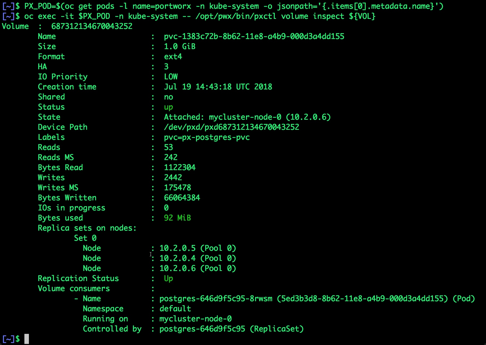
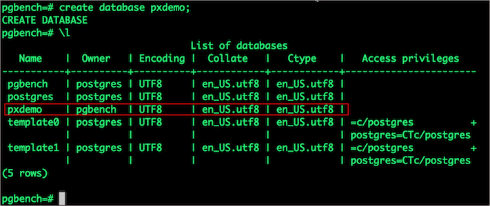
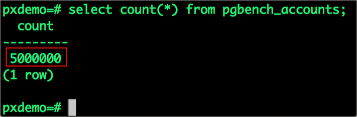
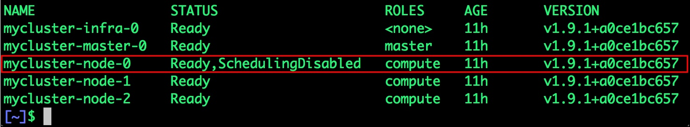
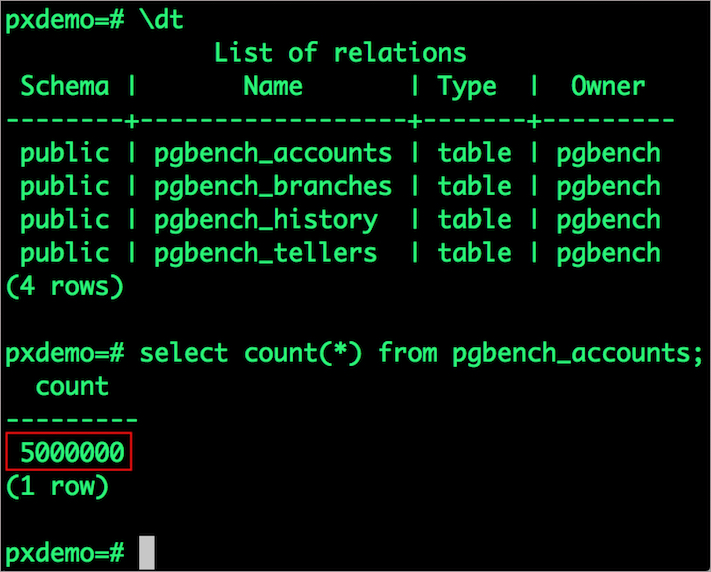
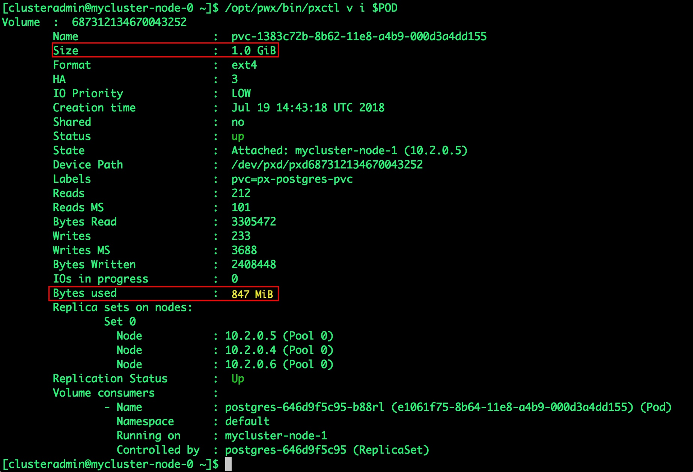
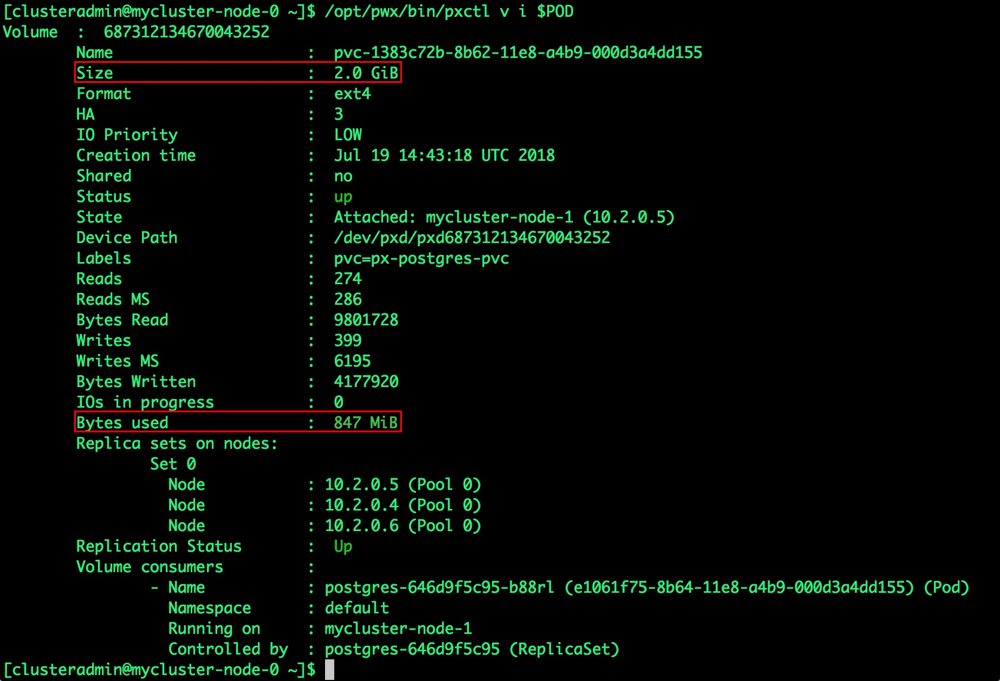

# Deploying HA PostgreSQL on OpenShift using Portworx

[Portworx](https://portworx.com/) is a cloud native storage platform to run persistent workloads deployed on a variety of orchestration engines, including Kubernetes and Red Hat OpenShift. With Portworx, customers can manage the database of their choice on any infrastructure using Red Hat OpenShift. It provides a single [Kubernetes storage](https://portworx.com/use-case/kubernetes-storage/) and data management layer for all stateful services,wherever they run and is optimized for low-latency, high-throughput workloads like Cassandra, Kafka, MongoDB, ElasticSearch, and the subject of today’s post, [PostgreSQL](https://postgresql.org).

 

Portworx is Red Hat certified for Red Hat OpenShift Container Platform, and PX-Enterprise is available in the [Red Hat Container Catalog](https://access.redhat.com/containers/#/product/8c28ed6afa0d15d7). [Learn more about Portworx & OpenShift in our Product Brief](https://portworx.com/wp-content/uploads/2018/04/Portworx_Openshift_ProductBrief.pdf).

This tutorial is a walk-through of the steps involved in deploying and managing a highly available PostgreSQL cluster on OpenShift. To install and configure an OpenShift Origin cluster and install Portworx, refer to the recent guide on [running HA MongoDB on Openshift](https://blog.openshift.com/deploying-ha-mongodb-on-openshift-using-portworx/).

In summary, to run HA PostgreSQL on OpenShift you need to:
* Create an OpenShift cluster running at least three nodes
* Install a cloud native storage solution like Portworx as a daemon set on OpenShift
* Create a storage class defining your storage requirements like replication factor, snapshot policy, and performance profile
* Deploy PostgreSQL using Kubernetes
* Test failover by killing or cordoning node in your cluster and confirming that data is still accessible
* Dynamically resize Postgres volume, snapshot and backup Postgres to Azure object storage

# Creating a Postgres storage class in OpenShift
Through Storage Class objects, an admin can define different classes of Portworx volumes that are offered in a cluster. These classes will be used during the dynamic provisioning of volumes. The Storage Class defines the replication factor, IO profile (e.g. for a database or a CMS), and priority (e.g. SSD or HDD). These parameters impact the availability and throughput of workload and can be specified for each volume. This is important because a production database will have different requirements than a development Jenkins cluster.

In this example, the Storage Class that we deploy has a replication factor of 3 with IO profile set to “db”, and priority set to “high”. This means that the storage will be optimized for low latency database workloads like PostgreSQL and automatically placed on the highest performance storage available in the cluster.

```
$ oc create -f https://raw.githubusercontent.com/fmrtl73/katacoda-scenarios-1/master/px-k8s-postgres-all-in-one/assets/px-repl3-sc.yaml 

storageclass "px-repl3-sc" created
```

## Creating a Postgres PVC on OpenShift
We can now create a Persistent Volume Claim (PVC) based on the Storage Class. Thanks to dynamic provisioning, the claims will be created without explicitly provisioning Persistent Volume (PV).

```
$ oc create -f https://raw.githubusercontent.com/fmrtl73/katacoda-scenarios-1/master/px-k8s-postgres-all-in-one/assets/px-postgres-pvc.yaml 

persistentvolumeclaim "px-postgres-pvc" created
```

The password for PostgreSQL will be created as a secret. Run the following commands to create the secret in the correct format.

```
$ echo postgres123 > password.txt 
$ tr -d '\n' .strippedpassword.txt && mv .strippedpassword.txt password.txt 

$ oc create secret generic postgres-pass --from-file=password.txt 
secret "postgres-pass" created
```

## Deploying Postgres on OpenShift
Finally, let’s create a PostgreSQL instance as a Kubernetes deployment object. For simplicity sake, we will just be deploying a single Postgres pod. Because Portworx provides synchronous replication for High Availability, a single Postgres instance might be the best deployment option for your Postgres database. Portworx can also provide backing volumes for multi-node Postgres deployments. The choice is yours.

```
$ oc create -f https://raw.githubusercontent.com/fmrtl73/katacoda-scenarios-1/master/px-k8s-postgres-all-in-one/assets/postgres-app.yaml 

deployment "postgres" created
```

Make sure that the Postgres pod is in Running state.

 

```
$ oc get pods -l app=postgres -o wide --watch
```

Wait till the Postgres pod is in Running state.

We can inspect the Portworx volume by accessing the pxctl tool running with the Postgres pod.

```
$ VOL=`oc get pvc | grep px-postgres-pvc | awk '{print $3}'` 
$ PX_POD=$(oc get pods -l name=portworx -n kube-system -o jsonpath='{.items[0].metadata.name}') 
$ oc exec -it $PX_POD -n kube-system -- /opt/pwx/bin/pxctl volume inspect ${VOL}
```
 

## Failing over PostgreSQL on OpenShift
Let’s populate the database will 5 million rows of sample data.
We will first find the pod that’s running PostgreSQL to access the shell.

```
$ POD=`oc get pods -l app=postgres | grep Running | grep 1/1 | awk '{print $1}'` 
$ oc exec -it $POD bash
```

Now that we are inside the pod, we can connect to Postgres and create a database.

```
# psql 
pgbench=# c\q 
pgbench=# \l 
pgbench=# \q
```
 

By default, pgbench will create 4 tables (pgbench_branches, pgbench_tellers, pgbench_accounts, and pgbench_history) with 100,000 rows in the main pgbench_accounts table. This creates a simple 16MB database.

The -s option is used for multiplying the number of rows entered into each table. In the command below, we enter a “scaling” option of 50. This tells pgbench to create a database with 50 times the default size.
What this means is our pgbench_accounts table now has 5,000,000 records. It also means our database size is now 800MB (50 x 16MB).

```
# pgbench -i -s 50 pxdemo;
```

Wait for pgbench to finish populating the table. After that’s done, let’s verify that the pgbench_accounts is populated by 5 million rows.

```
# psql pxdemo 
\dt 
select count(*) from pgbench_accounts; 
\q
exit
```

 

Now, let’s simulate the node failure by cordoning off the node on which PostgreSQL is running.

```
$ NODE=`oc get pods -l app=postgres -o wide | grep -v NAME | awk '{print $7}'` 
$ oc adm cordon ${NODE}
```
 

We will now go ahead and delete the PostgreSQL pod.

```
$ POD=`oc get pods -l app=postgres -o wide | grep -v NAME | awk '{print $1}'` 
$ oc delete pod ${POD} 

pod "postgres-646d9f5c95-8rwsm" deleted
```

As soon as the pod is deleted, it is relocated to the node with the replicated data. STorage ORchestrator for Kubernetes (STORK), Portworx’s custom storage scheduler, allows co-locating the pod on the exact node where the data is stored. It ensures that an appropriate node is selected for scheduling the pod.

Let’s verify this by running the below command. We will notice that a new pod has been created and scheduled in a different node.

 

Let’s uncordon the node to bring it back to action.

```
$ oc adm uncordon ${NODE} 

node "ip-172-20-57-55.ap-southeast-1.compute.internal" uncordoned
```

Finally, let’s verify that the data is still available.
Let’s find the pod name and exec into the container.

```
$ POD=`oc get pods -l app=postgres | grep Running | grep 1/1 | awk '{print $1}'` 
$ oc exec -it $POD bash
```

Now use psql to make sure our data is still there.

```
# psql pxdemo 
pxdemo=# \dt 
pxdemo=# select count(*) from pgbench_accounts; 
pxdemo=# \q 
pxdemo=# exit
```

 

## Performing Storage Operations on Postgres on OpenShift
After testing end-to-end failover of the database, let’s perform StorageOps on our Openshift cluster.

### Expanding the Volume with no downtime
We will now run a bigger benchmark to run out of space to show how easy it is to add space to a volume dynamically.
Open a shell inside the container.

```
$ POD=`oc get pods -l app=postgres | grep Running | awk '{print $1}'` 
$ oc exec -it $POD bash
```

Let’s use pgbench to run a baseline transaction benchmark which will try to grow the volume to more than 1 Gib and fail.

```
$ pgbench -c 10 -j 2 -t 10000 pxdemo 
$ exit
```

There may be multiple errors during the execution of the above command. The first error indicates that Pod is running out of space.

```
PANIC: could not write to file “pg_xlog/xlogtemp.73”: No space left on device
```

Since Kubernetes doesn’t support modifying the PVC after creation, we perform this operation directly on Portworx with the pxctl cli tool. Let’s get the volume name and inspect it through the pxctl tool. If you have access, SSH into one of the nodes and run the following command.

```
$ POD=`/opt/pwx/bin/pxctl volume list --label pvc=px-postgres-pvc | grep -v ID | awk '{print $1}'` 

$ /opt/pwx/bin/pxctl v i $POD
```

Notice that the volume is within 10% of being full. Let’s expand it using the following command.

 

```
$ /opt/pwx/bin/pxctl volume update $POD --size=2 

Update Volume: Volume update successful for volume 687312134670043252
```

 

### Taking Snapshots of a Kubernetes volume and restoring the Postgres database
Portworx supports creating snapshots for OpenShift PVCs. Let’s create a snapshot for the PVC we created for Postgres.

```
$ oc create -f https://github.com/fmrtl73/katacoda-scenarios-1/raw/master/px-k8s-postgres-all-in-one/assets/px-snap.yaml 

volumesnapshot "px-postgres-snapshot" created
```

You can see all the snapshots using the below command.

```
$ oc get volumesnapshot,volumesnapshotdata $ oc get volumesnapshot
```

 

```
$ oc get pods -l app=postgres-snap
```

With the snapshot in place, let’s go ahead and delete the database.

```
$ POD=`oc get pods -l app=postgres | grep Running | grep 1/1 | awk '{print $1}'` 
$ oc exec -it $POD bash 
$ psql 
drop database pxdemo; 
\l 
\q 
exit
```

Since snapshots are just like volumes, we can use it to start a new instance of PostgreSQL. Let’s create a new instance of PostgreSQL by restoring the snapshot data.

```
$ oc create -f https://raw.githubusercontent.com/fmrtl73/katacoda-scenarios-1/master/px-k8s-postgres-all-in-one/assets/px-snap-pvc.yaml 

persistentvolumeclaim "px-postgres-snap-clone" created
```

From the new PVC, we will create a PostgreSQL pod.

```
$ oc create -f https://raw.githubusercontent.com/fmrtl73/katacoda-scenarios-1/master/px-k8s-postgres-all-in-one/assets/postgres-app-restore.yaml 

deployment "postgres-snap" created
```

Verify that the new pod is in Running state.

```
$ oc get pods -l app=postgres-snap
```

Finally, let’s access the data created by the benchmark tool earlier in the walk-through.

```
$ POD=`oc get pods -l app=postgres-snap | grep Running | grep 1/1 | awk '{print $1}'` 
$ oc exec -it $POD bash 

$ psql pxdemo 
\dt 
select count(*) from pgbench_accounts; 
\q 
exit 
# psql pxdemo verify data
```

Notice that the table is still there with the data intact.

 

## Summary
Portworx can be easily deployed on Red Hat OpenShift to run stateful workloads in production. Through the integration of Portworx and OpenShift, DevOps and DataOps teams can seamlessly run highly available database clusters in OpenShift. They can perform traditional operations such as volume expansion, snapshots, backup and recovery for the cloud native applications.
